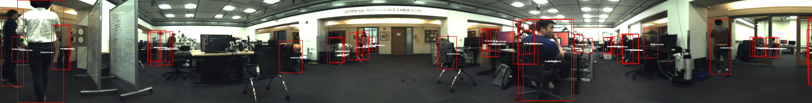

 
## Notes:

1. This repository includes fine-tuning the Facebook's DETR(Detection Transformer)[1, 2] on the JackRabbot Dataset and Benchmark[3, 4].
2. The result has been submitted to the [Detection Benchmark](https://jrdb.stanford.edu/leaderboards/detection) with [AP: 48.66%](https://jrdb.stanford.edu/leaderboards/results/535).
3. The model has been trained 32 epochs with the default trasforms in the DETR code(like cropping), and after that was trained 10 more epochs on the full stitched images.
4. I used the ResNet50 backbone, and changed the classification head to 2 (pedestrian and no-object).

## Instructions:

#### 1. Reformatting the JRDB annotations to MS-COCO format
* For refomatting the taining and validation annotations, run the JRDB2COCO_train_val.py.
* For reformatting the test annotations, run the JRDB2COCO_test.py 


#### 2. Change the dataset and annotation address
Chang the PATHS dictionary in the ./detr/datasets/JRDB.py, function build(image_set, args). 
Please consider that we work only on the stitched images.

#### 3. Mean and std of the training set has been calculated as follow for normalizing the data
You might change the values in make_JRDB_transforms(image_set) function for adding other transformations. You'll see the correspoing code in the External_Utils.py
* mean: tensor([0.3691, 0.3965, 0.3752])
* std:  tensor([0.2716, 0.2871, 0.2799])

#### 4. Training

Run the following command:
```
python main.py --dataset_file jrdb --data_path ../../jrdb_train/cvgl/group/jrdb/data/train_dataset --output_dir outputs  --resume ./outputs/checkpoint.pth --batch_size=1
```
#### 5. Test

Run the following command:
```
python main.py --dataset_file jrdb --data_path ../../jrdb_test/cvgl/group/jrdb/data/test_dataset --output_dir outputs  --resume ./outputs/checkpoint.pth --batch_size=1 --eval --no_aux_loss
```
#### 6. Using the JRDB ToolKit for calculating the AP

You should reformat the output to the KITTI format inorder to be used by the JRDB ToolKit. This has been done for the Training outputs in the lines 46-125, and also for the validation and test outputs in the lines 205-354 of ./detr/engine.py. You could change the addresses, and comment/uncomment some lines depending on your purpose. 

For calculating the AP for Training set and Validation set, you can use the JRDB ToolKit, by the following steps:
1. compile the JRDB ToolKit based on your setting(occluded level, ...) by 
* For Training: 
```
g++ -O3 -o evaluate_object_train.exe -I L:\boost\include\boost-1_68 evaluate_object.cpp
```
* For Validation:
```
g++ -O3 -o evaluate_object_val.exe -I L:\boost\include\boost-1_68 evaluate_object.cpp
```

2. Running the compiled executable
* For Training:
```
evaluate_object_train.exe ExperimentSetup/JRDB-KITTIED/Train ExperimentSetup/wot+wofo/E41/th_0.5/Train 0 output_file_E41_th0.5_train.txt
```
* For Validation:
```
evaluate_object_val.exe ExperimentSetup/JRDB-KITTIED/Val ExperimentSetup/wot+wofo/E41/th_0.5/Val 0 output_file_E41_th0.5_val.txt
```
#### 7. Submission to Benchmark
For the Test set, you should upload your outputs based on the submission policy on the website[5]. For getting the output based on the KITTI format, follow the step 6.

#### 8. Inference for applying Bounding Boxes
Place your desired images in the ./inference/inputs/ folder and use following command to draw BBoxes.
```
python main.py --dataset_file jrdb --data_path ../../jrdb_train/cvgl/group/jrdb/data/train_dataset --output_dir outputs  --resume ./outputs/checkpoint0041.pth --batch_size=1 --inference=1 --inference_out_path ./inference/outputs/wot+wofo/E41/th0.5
```

## Results after some of the epochs
| Architecture  | Epoch # | Default Transforms | Occlusion level  | Training AP | Validation AP |
| ----- | ------- | ----- | ------- | ----- | ----- |
| RN50  | 32 | Yes | 3 | 0.446| 0.242 |
| RN50  | 37 | No | 2 | 0.688 | 0.477 |
| RN50  | 39 | No | 2 | - | 0.476 |
| RN50  | 40 | No | 2 | - | 0.486 |
| RN50  | 41 | No | 2 | - | 0.496 |
| RN50  | 42 | No | 2 | - | 0.478 |
| RN50  | 43 | No | 2 | - | 0.508 |
| RN50  | 44 | No | 2 | - | 0.520 |

## Loss Curve
[./detr/outputs/loss.png|width=100px]]

## Sample output


## References
[1] N. Carion, F. Massa, G. Synnaeve, N. Usunier, A. Kirillov, S. Zagoruyko. End-to-End Object Detection with Transformers. In ECCV, 2020.

[2] https://github.com/facebookresearch/detr

[3] Martin-Martin, et al. In TPAMI, 2021

[4] https://jrdb.stanford.edu/

[5] https://jrdb.stanford.edu/benchmark/preparing
